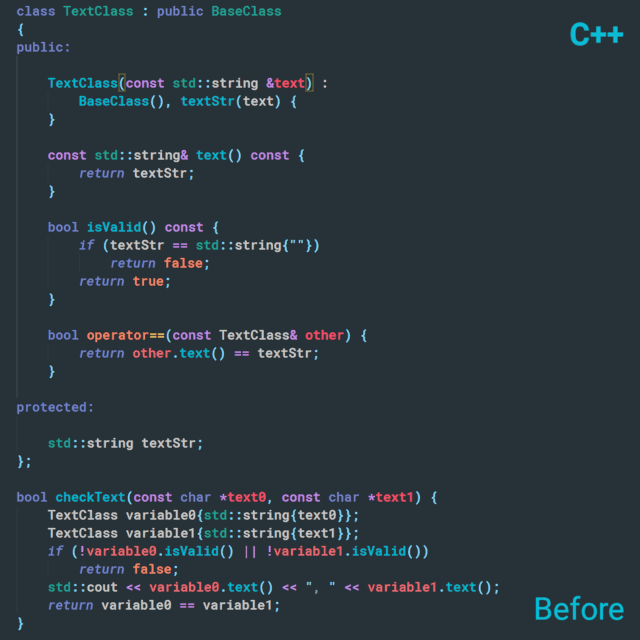

# Syntax Highlighter for VSCode

#### Syntax highlighter based on [Tree-Sitter](https://tree-sitter.github.io/tree-sitter/).
#### Languages:
#### C++, C, Python, TypeScript, TypeScriptReact, JavaScript,
#### Go, Rust, Php, Ruby, ShellScript, Bash, OCaml, Lua

#### Languages:
* C++
* C
* Python
* TypeScript
* TypeScriptReact
* JavaScript
* Go
* Rust
* Php
* Ruby
* ShellScript
* Bash
* OCaml
* Lua
* More to come...

#### Description

Provides universal syntax coloring engine for almost any programming language.
See [list of currently supported languages](#languages) above. Under the hood
the extension utilizes VSCode Decoration API to override syntax coloring provided
by standard TextMate regex matching. Constructing entire syntax tree, Tree-sitter
efficiently overcomes all limitations of built-in TextMate grammars. Being
context-aware, it's able to parse complex language structures providing complete
coverage of source code. Incremental parsing system ensures high performance.
All these advantages enable accurate and consistent syntax highlighting.

## Customization

{Syntax Highlighter} is a
[semantic token provider](https://code.visualstudio.com/api/language-extensions/semantic-highlight-guide).
It follows the current color theme out-of-the-box, as soon as the theme
enables semantic colorization through its `semanticHighlighting` setting.
You can forcefully enable semantic highlighting in `settings.json`:

    "editor.semanticTokenColorCustomizations": {
        "enabled": true, // enable for all themes
        "[Default Dark+]": {
            "enabled": true // enable for a particular theme
        }
    }

To customize token colors follow
[this guide](https://code.visualstudio.com/docs/getstarted/themes#_editor-semantic-highlighting).
For example:

    "editor.semanticTokenColorCustomizations": {
        "[Default Dark+]": {
            "enabled": true,
            "rules": {
                "type":  "#26A69A",
                "namespace": "#00897B",
                "function": "#00BCD4",
                "variable": "#42A5F5",
                "number": "#90A4AE",
                "string": {
                    "foreground": "#90A4AE",
                    "italic": true
                },
                "comment": {
                    "foreground": "#546E7A",
                    "fontStyle": "italic"
                },
                "variable.readonly.defaultLibrary": "#A89F9B",
                "macro": "#7E57C2",
                "keyword": "#7986CB",
                "operator": "#9575CD",
                "type.modification": "#00897B",
                "punctuation": "#A1887F"
            }
        }
    }

If no color is assigned to a semantic token by theme, the VSCode uses the
[Semantic Token Scope Map](https://code.visualstudio.com/api/language-extensions/semantic-highlight-guide#semantic-token-scope-map).

{Syntax Highlighter} provides the next tokens:
* **type** - types (class, struct, enum)
* **namespace** - scopes (namespace, module, outer class)
* **function** - functions (function, method, interface)
* **variable** - variables (variable, property, member)
* **number** - number literals (10, 10.0f, 0x10)
* **string** - string literals (string, regex, char)
* **comment** - comments
* **variable.readonly.defaultLibrary** - language constants (true, nullptr, nil)
* **macro** - directives (#include, import, use)
* **keyword** - control keywords (if, continue, return)
* **operator** - operators (&&, +=, ->)
* **type.modification** - modifiers (const, public, override)
* **punctuation** - punctuation symbols (., :, {)

**punctuation** is a custom (non-standard) token introduced by {Syntax Highlighter}.
Its fallback TextMate scope is *"punctuation"*. The default fallback for
**type.modification** is *"storage.modifier"*. Note that if you override **type**
color you should also override **type.modification**. Otherwise, **type.modification**
color will first fallback to a more general **type** instead of mapped TextMate scope.
The same goes for **variable** and **variable.readonly.defaultLibrary**.

## Settings
#### `syntax.highlightComment`
Enable/disable highlighting of comments.

This setting is useful, when you have other extensions, providing colorization within
comments. For example, highlighting of ToDo-like tags or documentation syntax, like
Doxygen or Sphinx. To not overwrite their colorization you can disable highlighting of
comments, putting `"syntax.highlightComment": false,` in your `settings.json`.

#### `syntax.highlightTerms`
List of enabled terms.

If you want to disable {Syntax Highlighter} for certain terms and use standard
coloring instead, just remove them from `syntax.highlightTerms` list in your
`settings.json`. By default all [supported terms]((#customization)) are enabled.

#### `syntax.highlightLanguages`
List of enabled languages.

If you want to disable {Syntax Highlighter} for certain languages and use standard
coloring instead, just remove them from `syntax.highlightLanguages` list in your
`settings.json`. By default all [supported languages]((#languages)) are enabled.

## [Build](BUILD.md)

{Syntax Highlighter} utilizes [WebAssembly bindings to the Tree-sitter parsing library](
https://github.com/tree-sitter/tree-sitter/tree/master/lib/binding_web).
All language parsers are [compiled to binary .wasm modules](
https://github.com/tree-sitter/tree-sitter/tree/master/lib/binding_web#generate-wasm-language-files).
To build .wasm you'll need Emscripten SDK. Refer to [BUILD.md](BUILD.md) for instructions.

## [Contribute](CONTRIBUTING.md)

The best way to contribute is to implement support of new languages. Extension
improvements are also welcome. Refer to [CONTRIBUTE.md](CONTRIBUTE.md) for details.

## [ToDo](TODO.md)
